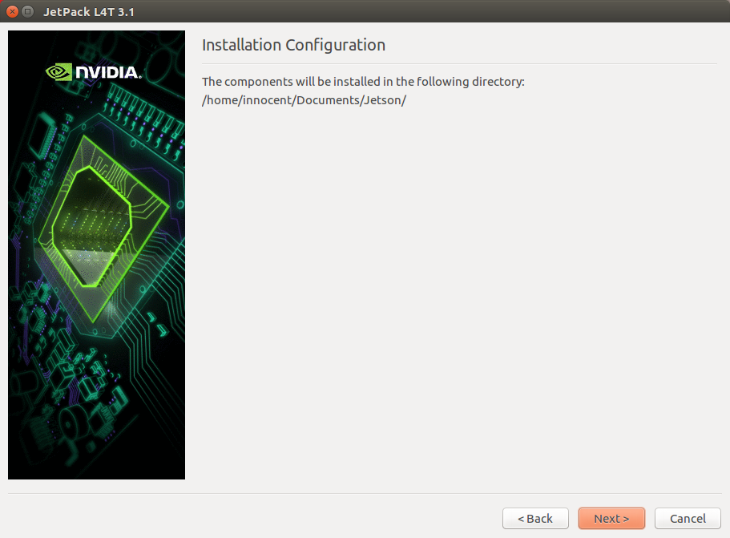

# Nvidia Jetson - Flashing OS

This section will provide the steps necessary to flash the Jetson Board in case of an OS failure

---

##### So you want to flash the Jetson with an OS? Well, you're in for quite an adventure.

First thing is first, you will need to have the following items to get started:

* The Jetson board and all of its accessories
* A keyboard, USB hub, a monitor, and a mouse
* A strong internet connection
* A host machine that is running Ubuntu

Once you have all of the items you are one step closer to getting the board flashed.

1. On your Ubuntu host machine, head to [https://developer.nvidia.com/embedded/jetpack](https://developer.nvidia.com/embedded/jetpack) to download the latest JetPack version.
   1. JetPack is the software used to flash the OS and other Nvidia toolkits onto the board with a GUI. 
2. Once it is downloaded, head to the download location of the  `jetpack-${VERSION}.run`  file.

   1. Now you will need to give it permissions so that you can execute it.

   2. In a terminal window, head to the location of the file and enter  `chmod +x jetpack-${VERSION}.run`

      

   3. Once that completes, you can now type `./jetpack-${VERSION}`to open the JetPack application

      

3. In the JetPack application,  it will select the installation directory

4. Select the board that you are using, the TX2

5. The application will ask for sudo permissions, enter your sudo password and hit authenticate

   

6. Once it has those permissions you will be presented with the Component Manager.

   1. Here you can select any component that you would like to install to the board. For this section's purposes, we will only be using the "`Linux for Tegra Host Side Image Setup`" package

7. In the Component Manager, select the option "Custom" and click the "clear Actions" button

8. To install just the OS and drivers:

   1. Check the "Automatically resolve dependency conflicts" option

   2. Click on the "Action" element of the "Linux for Tegra Host Side Image Setup" and select the "install" option

   3. Repeat step ii for the "Flash OS to Target" package and your manager should look like this:

   4. Click "Next" and accept all of the agreements

   5. Downloading the packages may take a few minutes but once they are done you should be prompted with a dialog that requires you are present for the next steps

   6. Your machine will take some time to install the necessary files and then you should be prompted with this screen

   7. Click the "Next" button and it will show you a list of actions that it will perform.

   8. Hitting next on that screen will bring up a this prompt:

   9. Once it is in Force USB Recovery Mode and appears with the `lsusb` command, hit enter in the "Post Installation" terminal and it should start the install process

9. To install other components, select the packages that you require and follow the necessary steps on screen.

Now that the Jetson is flashed with an OS and any other component, you can go back to testing _**autonomous**_ code.

