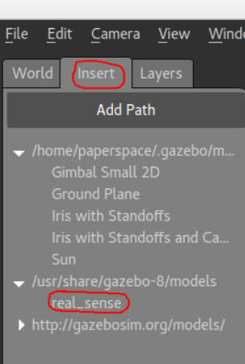
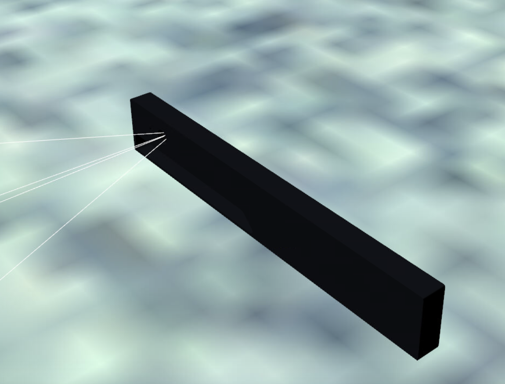

# Multi-Rotor Robot Design Team

# Simulation

Fall 2017

Our work this semester has been on simulating the IARC through the Gazebo Multi-Robot Simulator.  ArduPilot, the OS that runs on multi rotor robots, is compatible with Gazebo through Software In The Loop \(SITL\).

---

`IARCWorld.world` is located in `IARC-2018/Simulation/IARCWorld`.  To view it, go to its location and enter

```
gazebo --verbose IARCWorld.world
```

But to make the Roombas move you will have to compile the C++ plugin.

```
cd build
cmake ..
make
```

then you have two \(2\) options.

OPTION 1: If you DO want the drone to fly you'll have to copy `libObstacleControl.so` and `libmodel_push.so` from `IARC-2018/Simulation/IARCWorld/build` into `/usr/lib/x86_64-linux-gnu/gazebo-8/plugins`

```
sudo cp libmodel_push.so /usr/lib/x86_64-linux-gnu/gazebo-8/plugins/
sudo cp libObstacleControl.so /usr/lib/x86_64-linux-gnu/gazebo-8/plugins/
```

OPTION 2: If you DON'T want the drone to fly then

```
export GAZEBO_PLUGIN_PATH=$HOME/YOUR_PATH/IARCWorld/build:$GAZEBO_PLUGIN_PATH
```

Where YOUR\_PATH is the path to IARCWorld.

Hopefully the roombas move if you run `gazebo --verbose IARCWorld.world` now.

---

To make the drone fly, see [Software Setup](https://mst-multirotor.gitbooks.io/software/content/software-setup.html)

To connect, you'll need to use this command in one terminal and launch gazebo with our world file in another terminal:

```
sim_vehicle.py -f gazebo-iris
```

---

**IARCFly.py is still a work in progress.**

You may encounter a bug with PyGazebo similar to the below.

[https://github.com/jpieper/pygazebo/issues/27](https://github.com/jpieper/pygazebo/issues/27)

To resolve it, you'll need to install the library from source.

```
cd ~/
git clone https://github.com/jpieper/pygazebo.git
```

Then:

```
cd pygazebo
git checkout develop
sudo python2 setup.py install
```

---

### Getting the Intel RealSense camera in Gazebo

There is a RealSense camera model and plugin made by Intel: [https://github.com/intel/gazebo-realsense](https://github.com/intel/gazebo-realsense)

However, they didn't try very hard to make it work on other people's computers.  Here's what I had to do to make it work.

```
git clone https://github.com/intel/gazebo-realsense.git
cd gazebo-realsense
mkdir build
cd build
cmake ..
make
```

For me, `make`threw an error about incompatible protoc versions.  I needed an older version of protoc.  If you got protobuf recently, you have a version starting with 3.  You need one starting with 2.  If you get this error, in a separate terminal:

1. Go into your protobuf folder \(mine was in my home directory\) and run `sudo make uninstall`

2. Go to your home directory \(`cd ~`\) and run `sudo apt-get install protobuf-compiler`

Then `make` should run without errors, but neither `make install` nor `sudo make install` worked for me.

I had to run `sudo su` then run `make install`.

Then you should be able to add a RealSense in gazebo.





